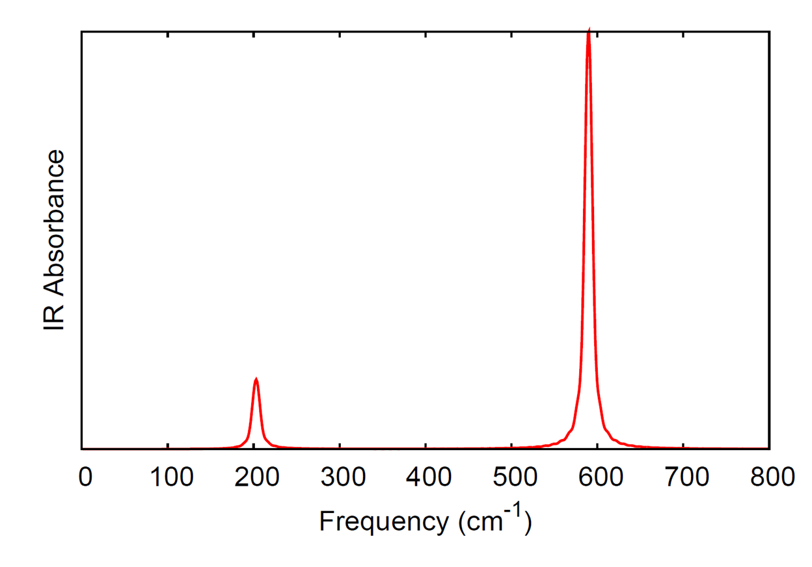
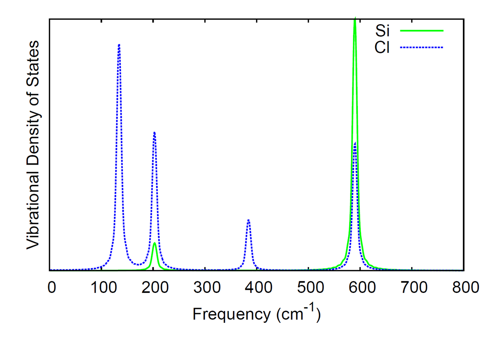

## Overview

This module performs adiabatic ab initio molecular dynamics on finite
systems. The nuclei are integrated using the velocity-Verlet algorithm,
and the electronic potential can be provided by any of the Gaussian
basis set based methods in NWChem, e.g. DFT, TDDFT, TCE, MP2, SCF,
MCSCF, etc. If analytic gradients are not available for the selected
level of theory, numerical gradients will automatically be used. Initial
velocities are randomly selected from the Maxwell-Boltzmann distribution
at the specified temperature, unless a restart file (.qmdrst) is
present. If a restart file is present, the trajectory information will
be read from that file and the trajectory will resume from that point.

For computational details and a case study using the module, please
refer to the following paper: S. A. Fischer, T. W. Ueltschi, P. Z.
El-Khoury, A. L. Mifflin, W. P. Hess, H.F. Wang, C. J. Cramer, N. Govind
"Infrared and Raman Spectroscopy from Ab Initio Molecular Dynamics and
Static Normal Mode Analysis: The CH Region of DMSO as a Case Study" J.
Phys. Chem. B, 120 (8), pp 1429–1436 (2016), [DOI:10.1021/acs.jpcb.5b03323](https://dx.doi.org/10.1021/acs.jpcb.5b03323) (2015) Publication Date (Web): July 29, 2015
```
QMD
  [dt_nucl <double default 10.0>]  
  [nstep_nucl <integer default 1000>]  
  [targ_temp <double default 298.15>]  
  [thermostat <string default none> <thermostat parameters>]  
  [rand_seed <integer default new one generated for each run>]  
  [com_step <integer default 100>]  
  [print_xyz <integer default 1>]  
  [linear]   
  [property <integer default 1>] 
  [tddft <integer default 1>]   
END
```
The module is called as:

`task `<level of theory>` qmd`

where <level of theory> is any Gaussian basis set method in NWChem

## QMD Keywords

### dt\_nucl -- Nuclear time step

This specifies the nuclear time step in atomic units (1 a.u. = 0.02419
fs). Default 10.0 a.u.

### nstep\_nucl -- Simulation steps

This specifies the number of steps to take in the nuclear dynamics.
Default 1000

### targ\_temp -- Temperature of the system

This specifies the temperature to use with the thermostat. Also it is
used in generating initial velocities from the Maxwell-Boltzmann
distribution. Default 298.15
K

### thermostat -- Thermostat for controling temperature of the simulation

This specifies the thermostat to use for regulating the temperature of
the nuclei. Possible options are:

  - none

`   No thermostat is used, i.e. an NVE ensemble is simulated. Default`

  - svr \<double default
1000.0\>

`   Stochastic velocity rescaling thermostat of Bussi, Donadio, and Parrinello J. Chem. Phys. 126, 014101 (2007)`  
`   Number sets the relaxation parameter of the thermostat`

  - langevin \<double default
0.1\>

`   Langevin dynamics, implementation according to Bussi and Parrinello Phys. Rev. E 75, 056707 (2007)`  
`   Number sets the value of the friction`

  - berendsen \<double default
1000.0\>

`   Berendsen thermostat, number sets the relaxation parameter of the thermostat`

  - rescale

`   Velocity rescaling, i.e. isokinetic ensemble`

### rand\_seed -- Seed for the random number generator

This specifies the seed for initializing the random number generator. If
not given, a unique random seed will be generated. Even without a
thermostat, this will influence the initial
velocities.

### com\_step -- How often center-of-mass translations and rotations are removed

This specifies that center-of-mass translations and rotations will be
removed every com\_step steps. Default 10 COM translations and rotations
are removed on startup (either randomized initial velocities or those
read from the restart file).

### print\_xyz -- How often to print trajectory information to xyz file

This specifies that the trajectory information (coordinates, velocities,
total energy, step number, dipole (if available)) to the xyz file. The
units for the coordinates and velocities in the xyz file are Angstrom
and Angstrom/fs, respectively.

### linear -- Flag for linear molecules

If present, the code assumes the molecule is linear.

### property -- How often to calculate molecular properties as part of the MD simulation

If present, the code will look for the property block and calculate the requested properties.  
For example, property 5 will calculate properties on the current geometry every 5 steps.  

### tddft -- How often to peform TDDFT calculation as part of the MD simulation  

If present, the code will look for the tddft block and calculate the absorption spectrum.  
For example, tddft 5 will perform tddft calculations on the current geometry every 5 steps.    

## Sample input

The following is a sample input for a ground state MD simulation. The
simulation is 200 steps long with a 10 a.u. time step, using the
stochastic velocity rescaling thermostat with a relaxation parameter of
100 a.u. and a target temperature of 200 K. Center-of-mass rotations and
translations will be removed every 10 steps and trajectory information
will be output to the xyz file every 5 steps.

`start qmd_dft_h2o_svr`  
`echo`  
`print low`  
`geometry noautosym noautoz`  
`  O   0.00000000    -0.01681748     0.11334792`  
`  H   0.00000000     0.81325914    -0.34310308`  
`  H   0.00000000    -0.67863597    -0.56441201`  
`end`  
`basis`  
`  * library 6-31G*`  
`end`  
`dft`  
`  xc pbe0`  
`end`  
`qmd`  
`  nstep_nucl  200`  
`  dt_nucl     10.0`  
`  targ_temp   200.0`  
`  com_step    10`  
`  thermostat  svr 100.0`  
`  print_xyz   5`  
`end`  
`task dft qmd`

The following is a sample input for an excited state MD simulation on
the first excited state. The simulation is 200 steps long with a 10 a.u.
time step, run in the microcanonical ensemble. Center-of-mass rotations
and translations will be removed every 10 steps and trajectory
information will be output to the xyz file every 5 steps.

`start qmd_tddft_h2o_svr`  
`echo`  
`print low`  
`geometry noautosym noautoz`  
`  O   0.00000000    -0.01681748     0.11334792`  
`  H   0.00000000     0.81325914    -0.34310308`  
`  H   0.00000000    -0.67863597    -0.56441201`  
`end`  
`basis`  
`  * library 6-31G*`  
`end`  
`dft`  
`  xc pbe0`  
`end`  
`tddft`  
`  nroots 5`  
`  notriplet`  
`  target 1`  
`  civecs`  
`  grad`  
`    root 1`  
`  end`  
`end`  
`qmd`  
`  nstep_nucl  200`  
`  dt_nucl     10.0`  
`  com_step    10`  
`  thermostat  none`  
`  print_xyz   5`  
`end`  
`task tddft qmd`

Additional sample inputs can be found in $NWCHEM\_TOP/QA/tests/qmd\_\*

## Processing the output of a QMD run

The xyz file produced by the QMD module contains the velocities (given
in Angstrom/fs), in addition to the coordinates (given in Angstrom). The
comment lines also contain the time step, total energy (atomic units),
and dipole moment (atomic units). In $NWCHEM\_TOP/contrib/qmd\_tools is a
code that will take the xyz trajectory and calculate the IR spectrum and
vibrational density of states from Fourier transforms of the dipole and
atomic momenta autocorrelation functions, respectively. The code needs
to be linked to a LAPACK library when compiled; the Makefile in the
directory will compile the code with the LAPACK routines included with
the NWChem source.

Here we compute the IR spectrum and the element-wise breakdown of the
vibrational density of states for silicon tetrachloride (SiCl4). The
following input file was used.

`start SiCl4`  
`echo`  
`print low`  
`geometry noautosym noautoz`  
`  Si              -0.00007905     0.00044148     0.00000001`  
`  Cl               0.71289590     1.00767685     1.74385011`  
`  Cl              -2.13658008    -0.00149375    -0.00000001`  
`  Cl               0.71086735    -2.01430142    -0.00000001`  
`  Cl               0.71289588     1.00767684    -1.74385011`  
`end`  
`basis`  
`  * library 6-31G`  
`end`  
`dft`  
`  xc hfexch 1.0`  
`end`  
`qmd`  
`  nstep_nucl  20000`  
`  dt_nucl     10.0`  
`  targ_temp   20.0`  
`  com_step    10`  
`  rand_seed   12345`  
`  thermostat  none`  
`end`  
`task dft qmd`

The IR spectrum and vibrational density of states were generated from
the [qmd\_analysis code](qmd_tools.tar.gz "wikilink") with the following
command.

`./qmd_analysis -xyz SiCl4.xyz -steps 15000 -skip 5000 -ts 10.0 -temp 20.0 -smax 800 -width 10.0`

where we have skipped the first 5000 steps from the simulation and only
used the data from the last 15000 steps to compute the spectra. The time
step is given as 10 a.u. since that was the time step in the simulation
and we output the trajectory information every step. The temperature was
set to 20 K (for analysis, this is only used in the calculation of the
quantum correction factor for the autocorrelation function of the dipole
moment). The option smax sets the maximum of the spectral window that is
output to 800 wave numbers. The width option sets the full-width at
half-maximum of the peaks in the resulting spectra.

The computed IR spectrum and vibrational density of states are shown
here.

 

