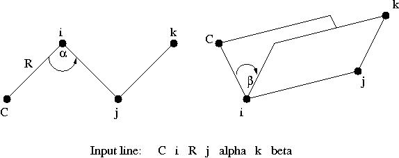
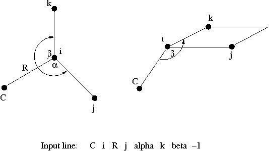

## ZMATRIX -- Z-matrix input

The ZMATRIX directive is an optional directive that can be used within
the compound GEOMETRY directive to specify the structure of the system
with a Z-matrix, which can include both internal and Cartesian
coordinates. The ZMATRIX directive is itself a compound directive that
can include the VARIABLES and CONSTANTS directives, depending on the
options selected. The general form of the compound ZMATRIX directive is
as follows:

`   [ZMATRIX || ZMT || ZMAT`  
`        `<string tagn>` `<list_of_zmatrix_variables>` `  
`        ... `  
`        [VARIABLES`  
`             `<string symbol>` `<real value>  
`             ... ]`  
`        [CONSTANTS`  
`             `<string symbol>` `<real value>  
`             ... ]`  
`   (END || ZEND)]`

The input module recognizes three possible spellings of this directive
name. It can be invoked with ZMATRIX, ZMT, or ZMAT. The user can specify
the molecular structure using either Cartesian coordinates or internal
coordinates (bond lengths, bond angles and dihedral angles. The Z-matrix
input for a center defines connectivity, bond length, and bond or
torsion angles. Cartesian coordinate input for a center consists of
three real numbers defining the x,y,z coordinates of the atom.

Within the Z-matrix input, bond lengths and Cartesian coordinates must
be input in the user-specified units, as defined by the value specified
for the variable <units> on the first line of the GEOMETRY directive.
All angles are specified in degrees.

The individual centers (denoted as i, j, and k below) used to specify
Z-matrix connectivity may be designated either as integers (identifying
each center by number) or as tags (If tags are used, the tag must be
unique for each center.) The use of dummy atoms is possible, by using X
or BQ at the start of the tag.

Bond lengths, bond angles and dihedral angles (denoted below as R,
alpha, and beta, respectively) may be specified either as numerical
values or as symbolic strings that must be subsequently defined using
the VARIABLES or CONSTANTS directives. The numerical values of the
symbolic strings labeled VARIABLES may be subject to changes during a
geometry optimization say, while the numerical values of the symbolic
strings labeled CONSTANTS will stay frozen to the value given in the
input. The same symbolic string can be used more than once, and any
mixture of numeric data and symbols is acceptable. Bond angles (α) must
be in the range 0 \< α \< 180.

The Z-matrix input is specified sequentially as follows:

`  tag1`  
`  tag2 i R`  
`  tag3 i R j alpha`  
`  tag4 i R j alpha k beta [orient]`  
`  ...`

The structure of this input is described in more detail below. In the
following discussion, the tag or number of the center being currently
defined is labeled as C (C for current). The values entered for these
tags for centers defined in the Z-matrix input are interpreted in the
same way as the <tag> entries for Cartesian coordinates described above
(see [Cartesian coordinate
input](#Cartesian_coordinate_input "wikilink")). Figures 1, 2 and 3
display the relationships between the input data and the definitions of
centers and angles.

Figure 1: Relationships between the centers, bond angle and dihedral
angle in Z-matrix input.

Figure 2: Relationships between the centers and two bond angles in
Z-matrix input with optional parameter specified as +1.

Figure 3: Relationships between the centers and two bond angles in
Z-matrix input with optional parameter specified as -1.

The Z-matrix input shown above is interpreted as follows:

1.  tag1  
    Only a tag is required for the first center.
2.  tag2 i R  
    The second center requires specification of its tag and the bond
    length ($R_{Ci}$) distance to a previous atom, which is identified
    by i.
3.  tag3 i R j alpha  
    The third center requires specification of its tag, its bond length
    distance ($R_{Ci}$) to one of the two previous centers (identified
    by the value of i), and the bond angle $\alpha = \widehat{Cij}$.
4.  tag i R j alpha k beta \[\<integer orient default 0\>\]  
    The fourth, and all subsequent centers, require the tag, a bond
    length ($R_{Ci}$) relative to center i, the bond angle with
    centers i and j ( $\alpha = \widehat{Cij}$, and either the
    dihedral angle (β) between the current center and centers i, j, and
    k (Figure 1), or a second bond angle $\beta = \widehat{Cik}$ and
    an orientation to the plane containing the other three centers
    (Figure 2 and 3).

By default, β is interpreted as a dihedral angle (see Figure 1), but if
the optional final parameter (<orient>) is specified with the value ±1,
then β is interpreted as the angle . The sign of
<orient> specifies the direction of the bond angle relative to the plane
containing the three reference atoms. If <orient> is +1, then the new
center (C) is above the plane (Figure 2); and if <orient> is -1, then C
is below the plane (Figure 3).

Following the Z-matrix center definitions described above, the user can
specify initial values for any symbolic variables used to define the
Z-matrix tags. This is done using the optional VARIABLES directive,
which has the general form:

` VARIABLES`  
`   `<string symbol>`  `<real value>  
`   ...`

Each line contains the name of a variable followed by its value.
Optionally, an equals sign (=) can be included between the symbol and
its value, for clarity in reading the input file.

Following the VARIABLES directive, the CONSTANTS directive may be used
to define any Z-matrix symbolic variables that remain unchanged during
geometry optimizations. To freeze the Cartesian coordinates of an atom,
refer to [Applying constraints in geometry
optimizations](#Applying_constraints_in_geometry_optimizations "wikilink").
The general form of this directive is as follows:

` CONSTANTS`  
`   `<string symbol>`  `<real value>  
`   ...`

Each line contains the name of a variable followed by its value. As with
the VARIABLES directive, an equals sign (=) can be included between the
symbol and its value.

The end of the Z-matrix input using the compound ZMATRIX directive is
signaled by a line containing either END or ZEND, following all input
for the directive itself and its associated optional directives.

A simple example is presented for water. All Z-matrix parameters are
specified numerically, and symbolic tags are used to specify
connectivity information. This requires that all tags be unique, and
therefore different tags are used for the two hydrogen atoms, which may
or may not be identical.

` geometry`  
`   zmatrix `  
`     O`  
`     H1 O 0.95`  
`     H2 O 0.95 H1 108.0`  
`   end`  
` end`

The following example illustrates the Z-matrix input for the molecule
. This input uses the numbers of centers to specify the
connectivity information (i, j, and k), and uses symbolic variables for
the Z-matrix parameters R, alpha, and beta, which are defined in the
inputs for the VARIABLES and CONSTANTS directives.

`geometry `  
` zmatrix`  
`  C `  
`  C 1 CC `  
`  H 1 CH1 2 HCH1 `  
`  H 1 CH2 2 HCH2 3  TOR1 `  
`  H 1 CH3 2 HCH3 3 -TOR2 `  
`  F 2 CF1 1 CCF1 3  TOR3 `  
`  F 2 CF2 1 CCF2 6  FCH1 `  
`  F 2 CF3 1 CCF3 6  -FCH1`  
`  variables`  
`    CC    1.4888 `  
`    CH1   1.0790 `  
`    CH2   1.0789  `  
`    CH3   1.0789  `  
`    CF1   1.3667 `  
`    CF2   1.3669 `  
`    CF3   1.3669`  
`  constants`  
`    HCH1  104.28 `  
`    HCH2  104.74 `  
`    HCH3  104.7 `  
`    CCF1  112.0713 `  
`    CCF2  112.0341 `  
`    CCF3  112.0340 `  
`    TOR1  109.3996 `  
`    TOR2  109.3997 `  
`    TOR3  180.0000 `  
`    FCH1  106.7846 `  
` end   `  
`end`

The input for any centers specified with Cartesian coordinates must be
specified using the format of the <tag> lines described in [Cartesian
coordinate input](#Cartesian_coordinate_input "wikilink") above.
However, in order to correctly specify these Cartesian coordinates
within the Z-matrix, the user must understand the orientation of centers
specified using internal coordinates. These are arranged as follows:

  - The first center is placed at the origin.
  - The third center is placed in the z-x plane.
